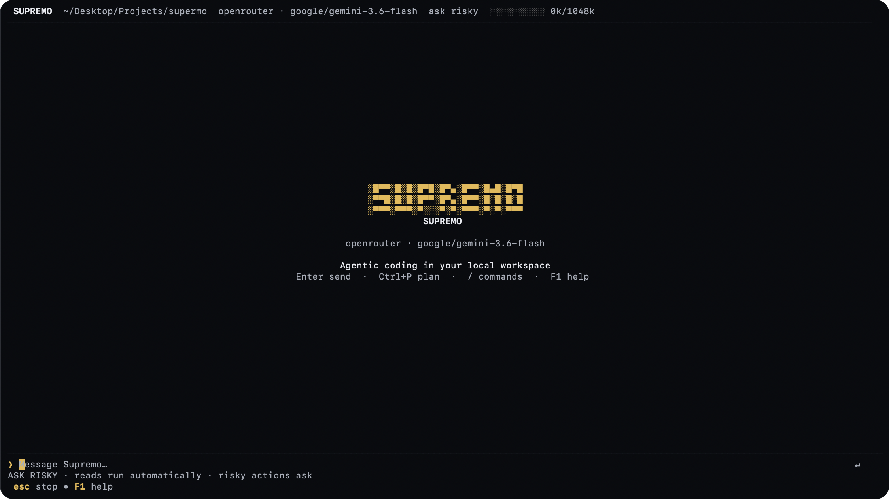

<div align="center">

  <a href="https://github.com/AbhaySingh002/Supremo">
    
  </a>

  <p><strong>Deterministic, local-first agentic coding in your terminal.</strong></p>

  <p>
    <a href="https://github.com/AbhaySingh002/Supremo/releases"></a>
    <a href="https://go.dev"></a>
    <a href="https://github.com/AbhaySingh002/Supremo/releases"></a>
    <a href="PROJECT.md"></a>
  </p>

</div>

---

### Install

```sh
# macOS & Linux
curl -fsSL https://raw.githubusercontent.com/AbhaySingh002/Supremo/main/scripts/install.sh | sh
```

```powershell
# Windows (PowerShell)
irm https://raw.githubusercontent.com/AbhaySingh002/Supremo/main/scripts/install.ps1 | iex
```

<details>
<summary><strong>Build via Go or from Source</strong></summary>

```sh
# Go 1.24+
go install github.com/AbhaySingh002/supremo/cmd/supremo@latest
```

```sh
# From Source
git clone https://github.com/AbhaySingh002/Supremo.git && cd Supremo && make build
```
</details>

---

<div align="center">
  
</div>

---

### Quickstart

```sh
cd /path/to/your/project
supremo
```

1. `/provider` — Connect Anthropic, OpenAI, Mistral, OpenRouter, or local Ollama/vLLM.
2. `/model` — Search and select a model.
3. `/init` — Index workspace and load project rules (`AGENTS.md`, `README.md`).
4. Start coding:
   ```text
   explain the authentication flow and run focused tests
   ```

---

### Key Capabilities

| Capability | Overview |
| :--- | :--- |
| **🔒 Local-First & Zero Telemetry** | Credentials, sessions, and files remain strictly local. Zero tracking. |
| **📊 Exact Token Accounting** | Live token meter (`0k/1048k`). Precise request envelopes compiled before dispatch. |
| **⚡ Modern Charm v2 TUI** | Powered by `bubbletea/v2`, `lipgloss/v2`, and `bubbles/v2`. Smooth animations and OS task progress bars. |
| **🛡️ Safe by Construction** | CAS filesystem locking, atomic writes, and tiered approval gates (`batman`, `strict`, `superman`, `dry-run`). |
| **🧭 Plan Mode** | Draft and review architectural plans before modifying code (<kbd>Ctrl</kbd>+<kbd>P</kbd>). |
| **🤖 Isolated Subagents** | Delegate sub-tasks to child agent sessions with scoped authority. |
| **🔌 Headless & API** | Scriptable CLI flags for CI/CD and authenticated loopback HTTP/SSE server. |

---

### Safety Modes

| Mode | Command | Read Actions | Mutating Actions | Best For |
| :--- | :--- | :--- | :--- | :--- |
| **`batman`** *(Default)* | `/batman` | Auto | Prompts confirmation (`y`/`n`/`e`) | Daily pair-programming |
| **`strict`** | `/strict` | Prompts | Prompts confirmation | Sensitive repositories |
| **`superman`** | `/superman` | Auto | Auto | Trusted autonomous scripts |
| **`dry-run`** | `/dry-run` | Auto | Simulated & logged | Pre-execution verification |
| **Plan Mode** | `/plan` | Allowed | Blocked; planning only | Architecture & research |

---

### Commands & Shortcuts

#### Slash Commands
| Command | Action |
| :--- | :--- |
| `/provider` | Switch provider or configure credentials |
| `/model` | Search and select models |
| `/plan [goal]` | Toggle Plan Mode or research objective |
| `/diff` | Interactive workspace diff viewer |
| `/tasks` | Inspect durable tasks, checklists, and plan state |
| `/session` | List, switch, rename, or create sessions |
| `/rewind` | Revert workspace files to checkpoints |
| `/doctor` | Verify workspace, tool, and provider connectivity |
| `/init` | Index workspace guidelines |

#### Keyboard Shortcuts
| Key | Context | Action |
| :--- | :--- | :--- |
| <kbd>Enter</kbd> | Composer | Send prompt or accept modal |
| <kbd>@</kbd> | Composer | Fuzzy-attach file or directory |
| <kbd>/</kbd> | Composer | Open command palette |
| <kbd>Ctrl</kbd>+<kbd>P</kbd> | Composer | Toggle Plan Mode |
| <kbd>Ctrl</kbd>+<kbd>M</kbd> | Composer | Cycle approval modes (`batman` ➔ `strict` ➔ `superman`) |
| <kbd>Ctrl</kbd>+<kbd>R</kbd> | Composer | Search prompt history |
| <kbd>Space</kbd> | Transcript | Expand or collapse tool batch |
| <kbd>Esc</kbd> | Global | Cancel, close overlay, or restore focus |
| <kbd>Ctrl</kbd>+<kbd>C</kbd> | Active Run | Interrupt running task |

---

### Headless & CI/CD

```sh
# Run one-shot summary
supremo --prompt "summarize changes in this repository"

# Permit mutations in CI
supremo --approve --prompt "run tests and fix failures"

# Pipe diff via stdin
git diff | supremo --prompt "review for performance regressions"

# Start loopback API daemon
supremo serve --listen 127.0.0.1:0
```

---

### Architecture

```text
Interactive TUI (Charm v2)  │  Headless CLI  │  HTTP/SSE API
                           ▼
                    backend.Service
              Durable Runs & Event Streams
                           ▼
                    RuntimeManager
            Session Agents & Child Subagents
                           ▼
   Context Compiler │ Tool Scheduler │ Provider Adapters
```

---

### Documentation

- [PROJECT.md](PROJECT.md) — Architecture & package ownership
- [COMMANDS.md](COMMANDS.md) — CLI, command, and keyboard reference
- [DEVELOPMENT.md](DEVELOPMENT.md) — Debug builds, logging, and release process
- [AGENTS.md](AGENTS.md) — Technical instructions for coding agents

---

<div align="center">
<sub>Built with Go and <a href="https://charm.sh">Charm</a> • <a href="https://github.com/AbhaySingh002/Supremo">AbhaySingh002/Supremo</a></sub>
</div>
