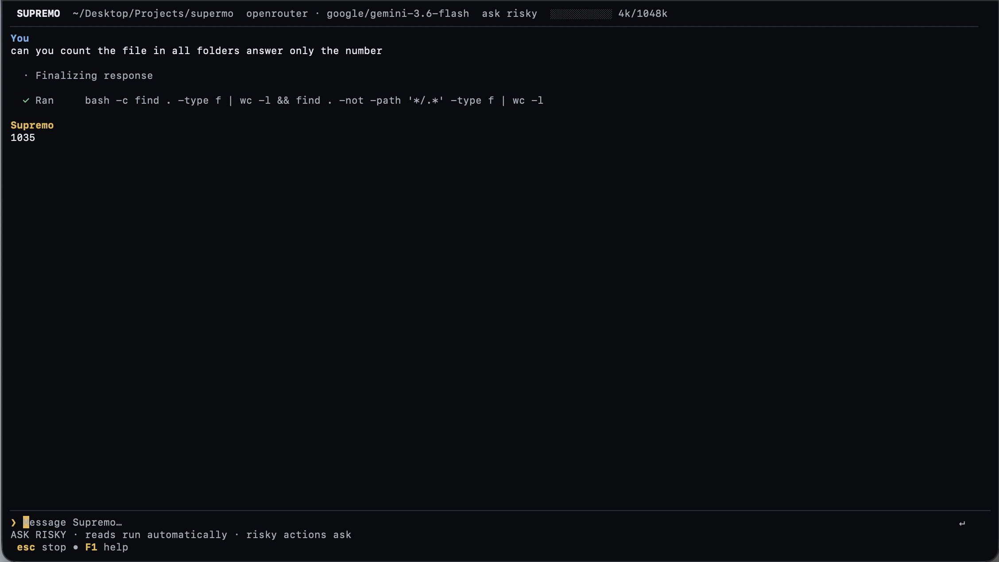

<div align="center">

# Supremo

**Deterministic, local-first agentic coding in your terminal.**

[](https://github.com/AbhaySingh002/Supremo/releases)
[](https://go.dev)
[](https://github.com/AbhaySingh002/Supremo/releases)
[](PROJECT.md)

<br/>

<p align="center">
  <a href="#-quick-install">Quick Install</a> &nbsp;•&nbsp;
  <a href="#-interactive-demo">Demo</a> &nbsp;•&nbsp;
  <a href="#-why-supremo">Why Supremo?</a> &nbsp;•&nbsp;
  <a href="#-interface-tour">Interface Tour</a> &nbsp;•&nbsp;
  <a href="#-safety--approvals">Safety & Approvals</a> &nbsp;•&nbsp;
  <a href="#-headless--automation">Headless & CI</a> &nbsp;•&nbsp;
  <a href="#-reference">Reference</a>
</p>

</div>

---

## ⚡ Quick Install

Install the latest verified release with a single command:

#### macOS & Linux
```sh
curl -fsSL https://raw.githubusercontent.com/AbhaySingh002/Supremo/main/scripts/install.sh | sh
```

#### Windows (PowerShell)
```powershell
irm https://raw.githubusercontent.com/AbhaySingh002/Supremo/main/scripts/install.ps1 | iex
```

<details>
<summary><strong>Alternative: Via Go (1.24+) or Build from Source</strong></summary>

<br/>

**Via Go install:**
```sh
go install github.com/AbhaySingh002/supremo/cmd/supremo@latest
```

**Build from source:**
```sh
git clone https://github.com/AbhaySingh002/Supremo.git
cd Supremo
make build
./supremo --version
```
</details>

---

## 🖥️ Interactive Demo

<table>
  <tr>
    <th align="left">&nbsp;🔴&nbsp;&nbsp;🟡&nbsp;&nbsp;🟢&nbsp;&nbsp;&nbsp;<b>Supremo — Agentic Terminal Execution</b></th>
  </tr>
  <tr>
    <td align="center">
      <a href="docs/architecture/demo.png">
        
      </a>
    </td>
  </tr>
</table>

<p align="center">
  <sub><strong>Autonomous Execution:</strong> Real-time streamed reasoning, bounded shell execution, precise answer generation, and deterministic token accounting.</sub>
</p>

---

## 💡 Why Supremo?

Most AI coding tools wrap language models in opaque cloud infrastructure with hidden prompt injections and unpredictable context retention. **Supremo** is engineered from first principles as an auditable, local-first engineering partner:

<table>
  <tr>
    <td width="50%">
      <h3>🔒 Local-First & Zero Telemetry</h3>
      <p>Workspace state, session transcripts, and credentials remain exclusively on your machine. Network calls only occur between your machine and your chosen model provider API.</p>
    </td>
    <td width="50%">
      <h3>📊 Deterministic Token Envelope</h3>
      <p>Every request compiles an exact, frozen provider envelope with real-time token metering. Pruning and compaction maintain tool-call/result pairs without silent context loss.</p>
    </td>
  </tr>
  <tr>
    <td width="50%">
      <h3>⚡ Charm v2 Terminal Interface</h3>
      <p>Powered by the latest <code>bubbletea/v2</code>, <code>lipgloss/v2</code>, and <code>bubbles/v2</code>. Features native terminal window titles, OS task progress bars, and zero-latency feed rendering.</p>
    </td>
    <td width="50%">
      <h3>🛡️ Safe by Construction</h3>
      <p>Multi-tier approval gates (<code>strict</code>, <code>batman</code>, <code>superman</code>, <code>dry-run</code>). Filesystem tools use atomic writes, path locking, and Compare-and-Swap (CAS) hash validation.</p>
    </td>
  </tr>
  <tr>
    <td width="50%">
      <h3>🧭 Plan Mode & Subagents</h3>
      <p>Draft architectural plans and clarify tradeoffs before modifying code. Delegate isolated subagents with bounded authority and durable child session lifecycles.</p>
    </td>
    <td width="50%">
      <h3>🔌 Dual-Mode Ergonomics</h3>
      <p>Use the full interactive TUI for exploratory pair-programming, or run headless one-shot CLI commands and an authenticated loopback HTTP/SSE server for automation.</p>
    </td>
  </tr>
</table>

---

## 🚀 Interface Tour

Launch Supremo inside any repository or workspace:

```sh
cd /path/to/your/project
supremo
```

<table>
  <tr>
    <th align="left">&nbsp;🔴&nbsp;&nbsp;🟡&nbsp;&nbsp;🟢&nbsp;&nbsp;&nbsp;<b>Supremo — Launch Canvas & Session State</b></th>
  </tr>
  <tr>
    <td align="center">
      <a href="docs/architecture/init.png">
        
      </a>
    </td>
  </tr>
</table>

<p align="center">
  <sub><strong>Launch Canvas:</strong> Real-time token budget meter (<code>0k/1048k</code>), active model indicator, approval state badge, and keystroke-driven controls.</sub>
</p>

### Key Interface Primitives

1. **Top Status & Telemetry Bar**
   - **Workspace Path**: Active working directory and repository root.
   - **Provider & Model Chip**: Currently active provider routing and model ID.
   - **Approval Badge**: Active safety mode (`ask risky` in default `batman` mode).
   - **Token Budget Meter**: Live progress meter tracking exact request/response token usage against provider window limits.

2. **Transcript Feed & Tool Execution**
   - **Live Thought Streams**: Real-time parsed reasoning steps (`· Finalizing response`, `· Searching files`).
   - **Tool Actions**: Explicit execution indicators with arguments and exit status (`✓ Ran`, `✓ Wrote`, `✓ Read`).
   - **Collapsible Batches**: Press <kbd>Space</kbd> to collapse or expand tool execution groups.

3. **Bottom Composer**
   - **Prompt Input**: Multiline text editor with full history search (<kbd>Ctrl</kbd>+<kbd>R</kbd>).
   - **Workspace Mentions**: Type `@` to fuzzy-search and inject files or directories into context.
   - **Command Palette**: Type `/` to open the searchable slash-command catalog.

---

## 🛡️ Safety & Approvals

Supremo never executes arbitrary mutations behind your back. Every session runs under an explicit approval policy:

| Mode | Trigger Command | Read Actions | Mutating Actions | Best For |
| :--- | :--- | :--- | :--- | :--- |
| **`batman`** *(Default)* | `/batman` | Auto-approved | Prompts for confirmation (`y`/`n`/`e`) | Everyday development |
| **`strict`** | `/strict` | Prompts | Prompts for confirmation | Audited or production environments |
| **`superman`** | `/superman` | Auto-approved | Auto-approved | Hands-free CI runs and trusted scripts |
| **`dry-run`** | `/dry-run` | Auto-approved | Simulated & logged without modifying disk | Pre-execution verification |
| **Plan Mode** | `/plan` | Allowed | Blocked; research & planning only | Multi-step architecture reviews |

> **Filesystem Integrity Guarantee:** File writes use read-before-write hashes and Compare-and-Swap (CAS) locking. If a file is concurrently modified on disk, Supremo rejects stale writes and prompts for resolution.

---

## 🤖 Headless & Automation

Supremo integrates cleanly into shell scripts, CI/CD pipelines, and editor extensions.

### One-Shot Prompts
```sh
# Run a dry-run summary
supremo --prompt "summarize recent changes in this repository"

# Run tests and permit mutations
supremo --approve --prompt "run the test suite and fix failing cases"

# Pipe prompt via standard input
git diff | supremo --prompt "review this diff for memory leaks"

# Resume an existing session
supremo --resume <session_id> --prompt "continue the benchmark analysis"
```

### Loopback API Server
Run Supremo as a local daemon exposing loopback JSON-RPC and Server-Sent Events (SSE):

```sh
supremo serve --listen 127.0.0.1:0
```
The daemon outputs its loopback endpoint and bearer token as JSON on startup, allowing external applications to subscribe to event streams and drive sessions.

---

## ⌨️ Command & Keyboard Reference

### Essential Slash Commands
| Command | Action |
| :--- | :--- |
| `/provider` | Switch provider or configure credentials |
| `/model` | Search and switch models on active provider |
| `/plan [objective]` | Toggle Plan Mode or research an architectural objective |
| `/diff` | Open the full interactive workspace diff viewer |
| `/tasks` | Inspect durable tasks, checklists, and plan execution state |
| `/session` | List, switch, rename, or create isolated sessions |
| `/rewind` | Revert workspace files to earlier checkpoints |
| `/doctor` | Verify workspace, tool, and provider connectivity |
| `/init` | Record workspace snapshot and load repository guidelines |

### Keyboard Shortcuts
| Key | Context | Action |
| :--- | :--- | :--- |
| <kbd>Enter</kbd> | Composer | Send prompt or confirm modal |
| <kbd>Shift</kbd>+<kbd>Enter</kbd> | Composer | Insert newline |
| <kbd>@</kbd> | Composer | Mention files or directories |
| <kbd>/</kbd> | Composer | Open slash-command menu |
| <kbd>Ctrl</kbd>+<kbd>M</kbd> | Composer | Cycle approval modes (`batman` ➔ `strict` ➔ `superman`) |
| <kbd>Ctrl</kbd>+<kbd>P</kbd> | Composer | Toggle Plan Mode |
| <kbd>Ctrl</kbd>+<kbd>R</kbd> | Composer | Search command and prompt history |
| <kbd>Space</kbd> | Transcript | Expand or collapse latest tool batch |
| <kbd>Up</kbd> / <kbd>Down</kbd> | Transcript | Scroll conversation history |
| <kbd>Esc</kbd> | Global | Dismiss modal, close menu, or restore focus |
| <kbd>Ctrl</kbd>+<kbd>C</kbd> | Active Run | Cancel current model run or tool execution |

---

## 🏛️ Architecture

Supremo enforces clean package boundaries with complete separation between frontend interaction, orchestration, and provider adapters:

```text
┌────────────────────────────────────────────────────────┐
│                      Frontends                         │
│   Interactive TUI (Charm v2)  │  Headless CLI  │  HTTP/SSE API  │
└───────────────────────────┬────────────────────────────┘
                            │ api.Client (Version 1 Contract)
                            ▼
┌────────────────────────────────────────────────────────┐
│                   backend.Service                      │
│   Durable Runs │ Idempotency │ Snapshots │ Event Streams│
└───────────────────────────┬────────────────────────────┘
                            ▼
┌────────────────────────────────────────────────────────┐
│                   RuntimeManager                       │
│      Session Agent A  │  Session Agent B  │  Subagents  │
│  ────────────────────────────────────────────────────  │
│   Context Compiler   │  Tool Scheduler  │  Providers   │
│   (Frozen Envelope)  │  (CAS Locks)     │  (Adapters)  │
└───────────────────────────┬────────────────────────────┘
                            ▼
┌────────────────────────────────────────────────────────┐
│            Local Storage & Temporary Artifacts         │
│   Config & Credentials  │  Transcripts  │  Checkpoints │
└────────────────────────────────────────────────────────┘
```

For deeper architectural details, request lifecycles, and subagent orchestration, see [PROJECT.md](PROJECT.md).

---

## 🤝 Contributing & Development

We welcome contributions! Please review our core guidelines before submitting pull requests:

- [AGENTS.md](AGENTS.md) — Technical instructions and architectural rules.
- [PROJECT.md](PROJECT.md) — Package boundaries and lifecycle maps.
- [COMMANDS.md](COMMANDS.md) — Comprehensive command and shortcut reference.
- [DEVELOPMENT.md](DEVELOPMENT.md) — Debug builds, logging system, and release workflow.

To validate your changes locally:
```sh
make precommit
```

---

<div align="center">
<sub>Built with Go and <a href="https://charm.sh">Charm</a> • Maintained by <a href="https://github.com/AbhaySingh002">AbhaySingh002</a></sub>
</div>
